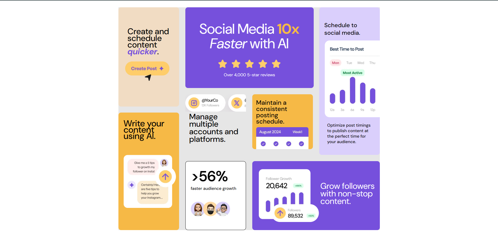

# Frontend Mentor - Bento Grid

This is a solution to the [Bento Grid challenge on Frontend Mentor](https://www.frontendmentor.io/challenges/bento-grid-RMydElrlOj).

## Overview

A responsive grid layout built using CSS Grid and media queries. Each grid item adjusts dynamically for different screen sizes.

### Screenshot

### Links

- [Solution](https://www.frontendmentor.io/solutions/responsive-layout-with-css-grid-and-media-queries-2AFBqn4vbc)
- [Live Site](https://fernandopizarrodw.github.io/Bento-grid-Fronted-Mentor/)

## Built With

- HTML5
- CSS3
- CSS Grid
- Mobile-first workflow

## What I Learned

This challenge helped me understand how to use CSS Grid for layout and how to resize grid items when transitioning to desktop view.

## Author

- GitHub - [@fernandopizarrodw](https://github.com/fernandopizarrodw)
- Frontend Mentor - [@fernandopizarrodw](https://www.frontendmentor.io/profile/fernandopizarrodw)
